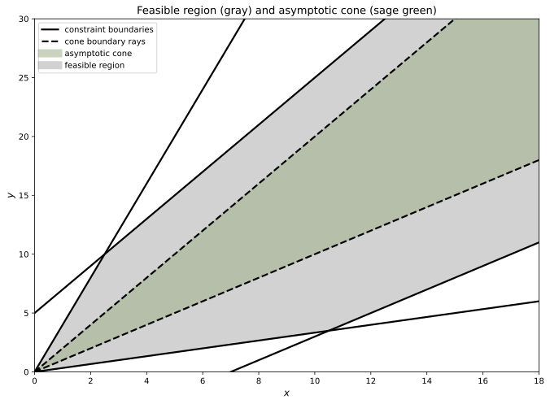

# asymptoticFunction 

This package was designed to approximately compute and visualize the asymptotic function of an arbitrary map $f: \mathbb{R}^n \to \mathbb{R}$. 
The asymptotic function is itself a map and is denoted as $f_\infty: \mathbb{R}^n \to \mathbb{R}$. The function $f_\infty$ describes the behavior of $f$ in 
infinite vector directions of the space $\mathbb{R}^n$ and is therefore useful for analyzing equilibrium problems including, but not limited to, optimization problems and variational inequalities. 
For a more formal treatment of the asymptotic function see [mathematical_background.md](docs/mathematical_background.md).

## Computing and Visualizing Asymptotic Cones 

The primary use-case of $f_\infty$ in our package is to find vector directions belonging to the set:

$$ \overline{X}_\infty := \{ d \in \mathbb{R}^n \mid (f_i)_\infty(d) \le 0 \text{ for } i \in \mathcal{I} \}. $$

This set contains all directions which are "asymptotically feasible" for constraint set given by functional-inequalities. 
That is, for a set of the form 

$$ X = \{ x \in \mathbb{R}^n \mid (f_i)(x) \leq 0 \}, $$ 

any direction $d \in \overline{X}_\infty$ describes an infinite ray upon which you will never leave the set $X$. Consider, for example, the set $X \subset \mathbb{R}^2$ given by the following inequalities: 

$$
\begin{aligned} 
x_2-4x_1 &\leq 0  \\
x_2-2x_1-5 &\leq 0\\
x_1 - 7 -x_2 &\leq 0 \\ 
\frac{1}{3}x_1-x_2 &\leq 0.
\end{aligned}
$$

The set $\overline{X}_\infty$ forms an asymptotic cone, sometimes also called a recession cone, which is shown below:

